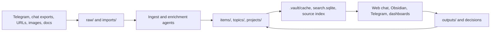

# VaultLens

VaultLens is a self-hosted, agent-maintained markdown knowledge base for everything you want to revisit later: links, articles, tweets, jobs, events, screenshots, notes to self, reminders, decisions, and recurring systems.

The core idea is simple: keep your long-term memory as explicit files, then let agents maintain, search, and surface those files. No opaque app memory. No provider lock-in. The vault is just markdown, images, JSONL logs, SQLite indexes, and portable source artifacts.

## Why VaultLens Exists

Most people save useful links into chats, notes apps, bookmarks, or screenshots and never see them again. VaultLens turns that messy capture stream into a personal wiki that agents can actually use:

- **Ingest anything** from chat exports, Telegram messages, URLs, screenshots, documents, and notes.
- **Compile structured markdown** with frontmatter, backlinks, summaries, source links, and durable context.
- **Ask questions** through a local web chat that searches the vault first and cites sources.
- **Surface what matters** through dashboards, task ledgers, deadline views, reading queues, and an optional morning Telegram brief.
- **Track decisions** so future agents can reuse prior reasoning instead of researching from scratch.
- **Stay portable** because your knowledge base is a normal file tree that works with Obsidian, editors, CLIs, and different AI providers.

## What You Get

- Markdown-first vault structure for `raw/`, `items/`, `topics/`, `projects/`, `dashboards/`, `outputs/`, and `.vault/`.
- Telegram ingestion with an agentic first-pass router for links, questions, screenshots, reminders, jobs, and calendar requests.
- Optional AWS Lambda webhook deployment so Telegram ingestion works even when your laptop is off.
- Local web interface for vault Q&A, chat history, citations, traces, and knowledge dashboards.
- Obsidian-friendly dashboards and templates.
- Local search/index pipeline using compact agent digests, SQLite FTS/BM25, source indexes, and health reports.
- Optional Playwright enrichment for dynamic or blocked pages.
- Optional Google Calendar integration for confirmation-first event creation and daily brief context.

## Repository Scope

This public repo contains only software, templates, configuration, and operating rules.

Tracked:

- `tools/`: ingestion, enrichment, search, Telegram, web query, calendar, task, and health tooling.
- `cloud/`: AWS SAM deployment for Telegram webhooks and S3-backed vault state.
- `web/`: local browser UI for chat and knowledge dashboards.
- `templates/`: canonical markdown note templates.
- `config/obsidian/`: shareable Obsidian defaults.
- `hooks/`: optional hook definitions for agent workflows.
- `AGENTS.md`, `WIKI.md`, `CLAUDE.md`, `GEMINI.md`: agent operating contracts.

Ignored by design:

- `raw/`, `imports/`, `items/`, `topics/`, `projects/`, `dashboards/`, `outputs/`, `memory/`
- `.vault/`, `.runtime/`, `.obsidian/`, `node_modules/`, `.aws-sam/`
- `.env.local`, `.env`, and all secret-bearing env files
- `hot.md`, `index.md`, `log.md`

Your personal vault data should never be committed.

## Requirements

- Node.js 22 or newer
- Python 3.10 or newer
- npm
- Optional: Obsidian for browsing the markdown vault
- Optional: Telegram bot token from BotFather
- Optional: AWS CLI, AWS SAM CLI, and Docker for always-on cloud ingestion
- Optional: Google Workspace CLI auth for Google Calendar actions
- Optional: Playwright browsers for local browser enrichment

## Quick Start

```bash
git clone https://github.com/suraj-ranganath/my-vault.git
cd my-vault
npm ci
cp .env.example .env.local
npm run vault:setup
npm run vault:compile
npm run vault:web
```

Then open `http://localhost:4318`.

At minimum, set this in `.env.local` before using agent-backed flows:

```bash
OPENAI_API_KEY=your_openai_api_key
```

## Configure Environment

`.env.example` documents the supported knobs. Common local values:

```bash
OPENAI_API_KEY=your_openai_api_key
TELEGRAM_BOT_TOKEN=your_telegram_bot_token
TELEGRAM_ALLOWED_CHAT_IDS=your_numeric_chat_id
VAULT_QUERY_PORT=4318
VAULT_QUERY_DEFAULT_MODEL=gpt-5.4
VAULT_PROFILE_HINT_FILES=raw/docs/my-profile.md,raw/docs/preferences.md
```

For cloud deployment:

```bash
AWS_REGION=us-west-2
STACK_NAME=vault-lens-telegram
TELEGRAM_WEBHOOK_SECRET=generated_or_left_blank_for_deploy_script
```

For Google Calendar, prefer a service account shared onto the target calendar:

```bash
GOOGLE_WORKSPACE_CLI_CREDENTIALS_JSON='{"type":"service_account","...":"..."}'
VAULT_CALENDAR_ID=your_calendar_id@example.com
```

Do not commit `.env.local`.

## Core Workflows

### Build Or Refresh The Vault Index

```bash
npm run rebuild:dashboards
npm run vault:compile
npm run vault:health
```

This refreshes machine-facing cache files, Obsidian dashboards, task ledgers, source indexes, and health reports.

### Run Local Web Chat

```bash
npm run vault:web
```

The web UI has two main surfaces:

- **Chat**: asks a Codex-backed agent to search the vault, cite sources, and answer with trace visibility.
- **Knowledge**: browses the compiled markdown knowledge base with filters, saved views, and source links.

### Ingest Chat Exports

Place exports under `imports/chat-exports/` or `raw/chat-exports/`, then run the relevant importer:

```bash
python3 tools/ingest_chat_export.py --help
python3 tools/ingest_whatsapp_inbox.py --vault-root .
```

After ingest:

```bash
npm run rebuild:dashboards
npm run vault:compile
```

### Ingest From Telegram Locally

```bash
npm run telegram:sync
npm run telegram:run
```

Telegram messages can include plain notes, links, screenshots, images with captions, job posts, reminders, questions, and calendar requests. The agent decides how to route each message and writes durable context back into the vault.

Useful Telegram commands:

- `/today`: urgent items and one high-signal read.
- `/queue`: recent saved items with action buttons.
- `/status`: bot and vault health.
- `/trace`: recent agent decisions and tool activity.

### Deploy Always-On Telegram Ingestion To AWS

```bash
npm run cloud:deploy
npm run cloud:sync-state
```

See [cloud/README.md](cloud/README.md) for the full AWS setup. The deployment uses:

- Lambda Function URL for the Telegram webhook
- one receiver Lambda
- one single-concurrency processor Lambda
- S3 for canonical ignored vault state and raw webhook events
- optional EventBridge Scheduler for the morning brief

### Enrich Weak Links Locally

```bash
npm run enrich:browser:recent
```

This uses Playwright for recent links that are weak, dynamic, blocked, or social-post-heavy. Browser artifacts should be treated as source evidence and stored under ignored vault state, not Git.

### Search From The CLI

```bash
npm run vault:search -- "agent memory systems"
npm run x:fetch -- https://x.com/example/status/123
npm run vault:heartbeat -- --dry-run
```

## Architecture



Design principles:

- Files over app databases.
- Explicit memory over hidden personalization.
- Search and cache before expensive model calls.
- Durable source artifacts over brittle live URLs.
- Agent traces and event logs over invisible automation.
- Cloud canonical state for always-on Telegram, with local mirrors for development and Obsidian.

## Data And Privacy Model

- Personal data lives in ignored vault directories and, if enabled, your private S3 bucket.
- Secrets live in `.env.local` or encrypted Lambda environment variables.
- GitHub should contain only code, docs, templates, and public configuration.
- Browser-captured artifacts, Telegram updates, image OCR, calendar action logs, and answer traces are vault state, not repo state.
- If you plan to make a fork public, run a secret scan and inspect `git status --ignored` before publishing.

## Testing

```bash
npm test
python3 -m unittest tools.test_vault_infra
node --check tools/telegram_codex_agent.mjs
node --check tools/vault_query_server.mjs
```

## Contributing

Contributions are welcome if they keep the project file-first, inspectable, and cost-aware.

Start with [CONTRIBUTING.md](CONTRIBUTING.md). Good first contribution areas:

- safer importers for more source formats
- better source extraction and citation quality
- stronger health checks and duplicate detection
- UI improvements for the web dashboard
- cheaper retrieval and caching strategies
- clearer setup docs for non-expert users

Please do not include real personal vault data, API keys, Telegram payloads, calendar exports, or private screenshots in issues or pull requests.

## License

MIT. See [LICENSE](LICENSE).
