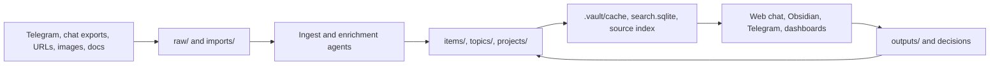

# VaultLens

VaultLens is a self-hosted, Telegram-first personal agent for the things you do not want to lose: events, screenshots, job posts, opportunity deadlines, articles, tweets, reminders, notes to self, decisions, and recurring systems.

Send something to your Telegram bot, and VaultLens decides what to do with it: save it to your knowledge base, extract a deadline, create a job/opportunity note, ask a clarifying question, add an event to Google Calendar after confirmation, or answer from your existing vault.

## Start Here: The Daily Utility Loop

VaultLens is most useful when Telegram becomes your capture surface and the agent becomes your daily filter.

- **Save calendar events from text or screenshots.** Send an event flyer, a screenshot, a QR/event page, or a message like "save this to my calendar." The bot extracts title, date, time, location, recurrence, and notes, asks for missing details when needed, then creates the Google Calendar event after you confirm.
- **Wake up to a focused 9am brief.** Configure the daily Telegram digest for 9am so it checks today's calendar, upcoming deadlines, urgent opportunities, reminders, recent saves, and your profile/preferences, then sends only the few things worth paying attention to.
- **Track opportunities without a spreadsheet.** Drop job links, fellowships, hackathons, events, application pages, and "maybe apply" notes into Telegram. VaultLens keeps the ledger organized by posted date, deadline, status, and priority.
- **Build an explicit "about you" memory.** The vault stores profile context, interests, decisions, systems, taste, past reasoning, and active projects as markdown so future answers are personalized without depending on opaque app memory.
- **Ask the bot questions later.** Use Telegram or the local web chat to ask things like "what should I apply to this week?", "what did I save about AI agents?", or "what is the most useful thing I read recently?"

Useful links:

- [Telegram ingestion](#ingest-from-telegram-locally)
- [Always-on AWS Telegram webhook](#deploy-always-on-telegram-ingestion-to-aws)
- [Google Calendar actions](cloud/README.md#google-calendar-actions)
- [Daily morning brief](cloud/README.md#optional-daily-morning-brief)
- [Local web chat](#run-local-web-chat)
- [Data and privacy model](#data-and-privacy-model)

## Example: Screenshot To Calendar

```text
You: [upload screenshot of an event flyer]
Caption: Save this to my calendar if the details are clear.

VaultLens: I found "AI Builders Night" on June 4 from 6:30 PM to 8:30 PM at Shack15.
Should I add this to your calendar?

You: yes

VaultLens: Added to Google Calendar.
```

The same flow works for single events, recurring classes, multi-day event batches, and modifications like "move the previous event to Friday" when the target event can be resolved from context. If details are ambiguous, the bot should ask before writing to the calendar.

## Example: 9am Daily Brief

```text
Morning brief | Tuesday

Today:
- 10:30 AM: Research sync.
- 4:00 PM: Swimming class.

Do first:
- Apply to the role with a deadline this week.
- Decide whether to pursue the fellowship you saved yesterday.

One useful read:
- The recent technical article you saved on agent memory, because it connects to your current VaultLens work.
```

The brief is agentic, not just a deterministic reminder list. Cheap code builds a candidate pack from calendars, deadlines, jobs, reminders, recent links, dashboards, and profile context; the agent chooses what is actually relevant enough to send.

## The Knowledge Base Underneath

VaultLens is also an agent-maintained markdown knowledge base for everything you want to revisit later. The core idea is simple: keep your long-term memory as explicit files, then let agents maintain, search, and surface those files. No opaque app memory. No provider lock-in. The vault is just markdown, images, JSONL logs, SQLite indexes, and portable source artifacts.

## Why VaultLens Exists

Most people save useful links into chats, notes apps, bookmarks, or screenshots and never see them again. VaultLens turns that messy capture stream into a personal wiki that agents can actually use:

- **Ingest from Telegram first** so capture works from your phone for links, notes, screenshots, jobs, events, reminders, and questions.
- **Create calendar actions safely** by extracting event details, asking for clarification when needed, and requiring confirmation before Google Calendar writes.
- **Send a high-signal daily brief** with calendar context, urgent deadlines, opportunities, reminders, and one useful recent read.
- **Ingest anything** from chat exports, Telegram messages, URLs, screenshots, documents, and notes.
- **Compile structured markdown** with frontmatter, backlinks, summaries, source links, and durable context.
- **Ask questions** through a local web chat that searches the vault first and cites sources.
- **Surface what matters** through dashboards, task ledgers, deadline views, reading queues, and the optional Telegram brief.
- **Track decisions** so future agents can reuse prior reasoning instead of researching from scratch.
- **Stay portable** because your knowledge base is a normal file tree that works with Obsidian, editors, CLIs, and different AI providers.

## What You Get

- Telegram ingestion with an agentic first-pass router for links, questions, screenshots, reminders, jobs, and calendar requests.
- Confirmation-first Google Calendar creation for event screenshots, event links, natural-language requests, recurring events, and event edits.
- Daily Telegram digest that can include today's important events, urgent opportunity deadlines, explicit reminders, high-impact applications, and one recommended reading.
- Optional AWS Lambda webhook deployment so Telegram ingestion works even when your laptop is off.
- Optional cloud browser-enrichment worker for X, LinkedIn, dynamic pages, redirects, and "fully extract this" requests.
- Local web interface for vault Q&A, chat history, citations, traces, and knowledge dashboards.
- Markdown-first vault structure for `raw/`, `items/`, `topics/`, `projects/`, `dashboards/`, `outputs/`, and `.vault/`.
- Obsidian-friendly dashboards and templates.
- Local search/index pipeline using compact agent digests, SQLite FTS/BM25, source indexes, and health reports.
- Optional Playwright enrichment for dynamic, blocked, or link-inside-link pages, locally or through the browser worker.

## Repository Scope

This public repo contains only software, templates, configuration, and operating rules.

Tracked:

- `tools/`: ingestion, enrichment, search, Telegram, web query, calendar, task, and health tooling.
- `cloud/`: AWS SAM deployment for Telegram webhooks and S3-backed vault state.
- `web/`: local browser UI for chat and knowledge dashboards.
- `templates/`: canonical markdown note templates.
- `config/obsidian/`: shareable Obsidian defaults.
- `hooks/`: optional hook definitions for agent workflows.
- `AGENTS.md`, `WIKI.md`, `CLAUDE.md`, `GEMINI.md`: agent operating contracts.

Ignored by design:

- `raw/`, `imports/`, `items/`, `topics/`, `projects/`, `dashboards/`, `outputs/`, `memory/`
- `.vault/`, `.runtime/`, `.obsidian/`, `node_modules/`, `.aws-sam/`
- `.env.local`, `.env`, and all secret-bearing env files
- `hot.md`, `index.md`, `log.md`

Your personal vault data should never be committed.

## Requirements

- Bun 1.3 or newer
- uv 0.9 or newer
- Optional: Node.js 22 or newer for direct `node --check` syntax validation
- Optional: Python 3.10 or newer if you prefer a system Python instead of uv-managed Python
- Optional: Obsidian for browsing the markdown vault
- Optional: Telegram bot token from BotFather
- Optional: AWS CLI, AWS SAM CLI, and Docker for always-on cloud ingestion
- Optional: Google Workspace CLI auth for Google Calendar actions
- Optional: Playwright browsers for local browser enrichment

## Quick Start

```bash
git clone https://github.com/suraj-ranganath/VaultLens.git
cd VaultLens
bun install
uv sync
cp .env.example .env.local
bun run vault:setup
bun run vault:compile
bun run vault:web
```

Then open `http://localhost:4318`.

The default `uv sync` install is intentionally CI-safe and does not install the live Codex SDK runtime. Before using agent-backed flows locally, install the Codex extra and authenticate once:

```bash
uv sync --extra codex
codex login --device-auth
```

The Python Codex SDK reuses your local `~/.codex/auth.json`. VaultLens does not require OpenAI API keys and should not spend OpenAI API credits.

## Configure Environment

`.env.example` documents the supported knobs. Common local values:

```bash
TELEGRAM_BOT_TOKEN=your_telegram_bot_token
TELEGRAM_ALLOWED_CHAT_IDS=your_numeric_chat_id
VAULT_QUERY_PORT=4318
VAULT_CODEX_MODEL=auto
VAULT_QUERY_DEFAULT_MODEL=auto
VAULT_CODEX_SANDBOX=full_access
VAULT_AGENTIC_WORK_AUTO=true
VAULT_WORK_WEB_SEARCH_ENABLED=true
VAULT_BROWSER_AUTO_TRIGGER=true
VAULT_PROFILE_HINT_FILES=raw/docs/my-profile.md,raw/docs/preferences.md
```

For cloud deployment:

```bash
AWS_REGION=us-west-2
STACK_NAME=vault-lens-telegram
TELEGRAM_WEBHOOK_SECRET=generated_or_left_blank_for_deploy_script
VAULT_CODEX_AUTH_S3_KEY=codex-auth/auth.json
VAULT_BROWSER_ENRICH_LIMIT=24
VAULT_BROWSER_ENRICH_CONCURRENCY=2
VAULT_BROWSER_ENRICH_LOOKBACK_DAYS=30
```

For ChatGPT Pro/Plus accounts, run `codex login --device-auth` locally and let `bun run cloud:deploy` sync your local `~/.codex/auth.json` into the private S3 state bucket before Telegram webhooks are installed. If you have a Business/Enterprise Codex access token, you can set `CODEX_ACCESS_TOKEN` instead and skip the auth-file fallback.

For Google Calendar, prefer a service account shared onto the target calendar:

```bash
GOOGLE_WORKSPACE_CLI_CREDENTIALS_JSON='{"type":"service_account","...":"..."}'
VAULT_CALENDAR_ID=your_calendar_id@example.com
```

Do not commit `.env.local`.

## Core Workflows

### Build Or Refresh The Vault Index

```bash
bun run rebuild:dashboards
bun run vault:compile
bun run vault:health
```

This refreshes machine-facing cache files, Obsidian dashboards, task ledgers, source indexes, and health reports.

### Run Local Web Chat

```bash
bun run vault:web
```

The web UI has two main surfaces:

- **Chat**: asks a Codex-backed agent to search the vault, cite sources, and answer with trace visibility.
- **Knowledge**: browses the compiled markdown knowledge base with filters, saved views, and source links.

### Ingest Chat Exports

Place exports under `imports/chat-exports/` or `raw/chat-exports/`, then run the relevant importer:

```bash
uv run python tools/ingest_chat_export.py --help
uv run python tools/ingest_whatsapp_inbox.py --vault-root .
```

After ingest:

```bash
bun run rebuild:dashboards
bun run vault:compile
```

### Ingest From Telegram Locally

```bash
bun run telegram:sync
bun run telegram:run
```

Telegram messages can include plain notes, links, screenshots, images with captions, job posts, reminders, questions, and calendar requests. The agent decides how to route each message and writes durable context back into the vault.

Useful Telegram commands:

- `/today`: urgent items and one high-signal read.
- `/queue`: recent saved items with action buttons.
- `/status`: bot and vault health.
- `/trace`: recent agent decisions and tool activity.

For normal Telegram saves, VaultLens does not stop at deterministic parsing. The fast processor captures the message, then a full-access Codex `vault-work` pass can inspect the vault, run shell workflows, follow links, write canonical notes, update topics/projects/decisions/systems, improve memory-review artifacts, and adjust indexes/dashboards/templates when that makes the knowledge base easier for future agents to use.

### Deploy Always-On Telegram Ingestion To AWS

```bash
bun run cloud:deploy
bun run cloud:sync-state
```

`cloud:deploy` automatically runs `cloud:sync-codex-auth` when `CODEX_ACCESS_TOKEN` is not set. Re-run `bun run cloud:sync-codex-auth` after `codex login --device-auth` refreshes your local Codex auth.

See [cloud/README.md](cloud/README.md) for the full AWS setup. The deployment uses:

- Lambda Function URL for the Telegram webhook
- one receiver Lambda
- one single-concurrency processor Lambda that runs the router, basic ingest, and full-access Codex `vault-work` pass
- one single-concurrency Playwright browser-worker Lambda for heavy extraction
- S3 for canonical ignored vault state and raw webhook events
- optional EventBridge Scheduler for the morning brief

### Enrich Weak Links Locally

```bash
bun run enrich:browser:recent
```

This uses Playwright for recent links that are weak, dynamic, blocked, social-post-heavy, or need link-inside-link extraction. It writes evidence packs under `raw/web-clips/browser-artifacts/`, follows a bounded number of linked targets, and updates canonical notes with source provenance.

In AWS, browser-heavy domains and explicit requests like "fully extract this" trigger the separate browser worker when `VAULT_BROWSER_AUTO_TRIGGER=true`. The fast Telegram processor still handles ordinary saves and questions without waiting on browser startup.

### Search From The CLI

```bash
bun run vault:search -- "agent memory systems"
bun run x:fetch -- https://x.com/example/status/123
bun run vault:heartbeat -- --dry-run
```

## Architecture



Design principles:

- Files over app databases.
- Explicit memory over hidden personalization.
- Search and cache before expensive model calls.
- Durable source artifacts over brittle live URLs.
- Agent traces and event logs over invisible automation.
- Cloud canonical state for always-on Telegram, with local mirrors for development and Obsidian.

## Data And Privacy Model

- Personal data lives in ignored vault directories and, if enabled, your private S3 bucket.
- Secrets live in `.env.local` or encrypted Lambda environment variables.
- GitHub should contain only code, docs, templates, and public configuration.
- Browser-captured artifacts, Telegram updates, image OCR, calendar action logs, and answer traces are vault state, not repo state.
- If you plan to make a fork public, run a secret scan and inspect `git status --ignored` before publishing.

## Testing

```bash
bun run test
uv run python -m unittest tools.test_vault_infra
uv run python -m py_compile tools/codex_agent_runner.py
node --check tools/vault_query_server.mjs
```

## Contributing

Contributions are welcome if they keep the project file-first, inspectable, and cost-aware.

Start with [CONTRIBUTING.md](CONTRIBUTING.md). Good first contribution areas:

- safer importers for more source formats
- better source extraction and citation quality
- stronger health checks and duplicate detection
- UI improvements for the web dashboard
- cheaper retrieval and caching strategies
- clearer setup docs for non-expert users

Please do not include real personal vault data, API keys, Telegram payloads, calendar exports, or private screenshots in issues or pull requests.

## License

MIT. See [LICENSE](LICENSE).
